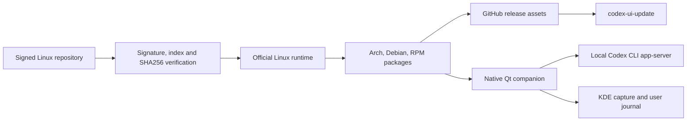

# Architecture

## English

Codex UI Linux Port is packaging automation around the official ChatGPT Linux runtime. It preserves the upstream application bundle and adds only package-manager, launcher, updater, and companion integration.



```text
Signed Linux repository
  -> Signature, index, and SHA256 verification
  -> Official Linux runtime
  -> Arch, Debian, and RPM packages
  -> GitHub release assets
  -> codex-ui-update
```

## Components

- `scripts/resolve-linux-source`: verifies the official repository and resolves the current Linux package.
- `scripts/build-from-linux`: extracts the official runtime unchanged, adds local integration, and produces packages.
- `scripts/build-recipe-sha`: fingerprints package-affecting inputs so an integration change rebuilds an existing upstream version.
- `scripts/install-linux-integration`: installs the launcher, updater hooks, desktop entry, and companion files.
- `scripts/build-packages`: creates Arch, Debian, and RPM package outputs from a prepared package root.
- `scripts/validate-release-artifacts`: validates the expected release asset set and checksums.
- `scripts/codex-ui-update`: detects the host package manager, downloads the matching package, verifies checksums, installs, and can smoke-test.
- `scripts/codex-ui-companion.py`: provides a separate native Qt process for local usage, capture, and filtered crash metadata.
- `packaging/`: package metadata templates.
- `docs/`: usage, packaging, security, publication, and AUR notes.

## Trust Boundaries

- Upstream Codex UI assets remain governed by upstream owners and terms.
- Repository-authored automation and packaging metadata are separate from upstream software.
- Release artifacts are generated by GitHub Actions as the authoritative builder.
- Local runtime data, chats, credentials, and extracted app trees must not enter git.
- The companion reads transient account status from a read-only Codex CLI app-server and never parses session archives.
- Crash reports use an explicit field allowlist and exclude core contents, command lines, and process environments.

---

# Arquitectura

## Español

Codex UI Linux Port automatiza el empaquetado del runtime Linux oficial de ChatGPT. Conserva el bundle upstream y añade únicamente integración con gestores de paquetes, launcher, updater y companion.

## Componentes

- `scripts/resolve-linux-source`: verifica el repositorio oficial y resuelve el paquete Linux actual.
- `scripts/build-from-linux`: extrae sin cambios el runtime oficial, añade la integración local y produce paquetes.
- `scripts/build-recipe-sha`: genera la huella de los inputs que afectan al paquete para reconstruir una versión upstream cuando cambia la integración.
- `scripts/install-linux-integration`: instala el launcher, los hooks del updater, la entrada de escritorio y los archivos del companion.
- `scripts/build-packages`: crea salidas Arch, Debian y RPM desde un package root preparado.
- `scripts/validate-release-artifacts`: valida el conjunto esperado de assets de release y checksums.
- `scripts/codex-ui-update`: detecta el gestor de paquetes del host, descarga el paquete compatible, verifica checksums, instala y puede ejecutar smoke test.
- `scripts/codex-ui-companion.py`: aporta un proceso Qt nativo separado para consumo local, capturas y metadatos filtrados de fallos.
- `packaging/`: plantillas de metadata de paquetes.
- `docs/`: notas de uso, empaquetado, seguridad, publicación y AUR.

## Límites de confianza

- Los assets upstream de Codex UI siguen gobernados por sus propietarios y términos.
- La automatización y metadata de empaquetado del repo están separadas del software upstream.
- GitHub Actions es el builder autoritativo de artefactos de release.
- Datos runtime locales, chats, credenciales y árboles de app extraídos no deben entrar en git.
- El companion consulta estado transitorio mediante un `app-server` de Codex CLI en modo de solo lectura y no analiza archivos de sesiones.
- Los informes de fallo usan una lista explícita de campos permitidos y excluyen el core, los argumentos y el entorno del proceso.
