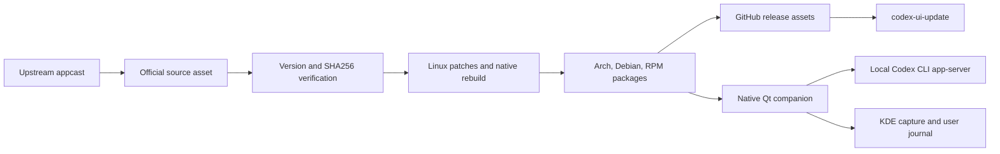

# Architecture

## English

Codex UI Linux Port is packaging automation around upstream Codex UI release artifacts. It does not own or modify upstream product behavior beyond Linux packaging patches required for desktop integration.



```text
Upstream appcast
  -> Official source asset
  -> Version and SHA256 verification
  -> Linux patches and native rebuild
  -> Arch, Debian, and RPM packages
  -> GitHub release assets
  -> codex-ui-update
```

## Components

- `scripts/build-from-dmg`: extracts the official source asset, rebuilds native modules, applies Linux patches, and produces packages.
- `scripts/build-recipe-sha`: fingerprints package-affecting inputs so a patch change rebuilds an existing upstream version.
- `scripts/apply-linux-patches`: grants audio-only media permission to the trusted app session for upstream voice and dictation while retaining the existing denial for camera access.
- `scripts/build-packages`: creates Arch, Debian, and RPM package outputs from a prepared package root.
- `scripts/validate-release-artifacts`: validates the expected release asset set and checksums.
- `scripts/codex-ui-update`: detects the host package manager, downloads the matching package, verifies checksums, installs, and can smoke-test.
- `scripts/codex-ui-companion.py`: provides a separate native Qt process for local usage, capture, and filtered crash metadata.
- `tools/`: pinned Node.js tooling for reproducible native module rebuilds.
- `packaging/`: package metadata templates.
- `docs/`: usage, packaging, security, publication, and AUR notes.

## Trust Boundaries

- Upstream Codex UI assets remain governed by upstream owners and terms.
- Repository-authored automation and packaging metadata are separate from upstream software.
- Release artifacts are generated by GitHub Actions as the authoritative builder.
- Local runtime data, chats, credentials, and extracted app trees must not enter git.
- The companion reads transient account status from a read-only Codex CLI app-server and never parses session archives.
- Crash reports use an explicit field allowlist and exclude core contents, command lines, and process environments.

---

# Arquitectura

## Español

Codex UI Linux Port es automatización de empaquetado alrededor de artefactos upstream de Codex UI. No posee ni modifica el comportamiento del producto upstream más allá de patches de empaquetado necesarios para integración Linux.

## Componentes

- `scripts/build-from-dmg`: extrae el artefacto oficial, recompila módulos nativos, aplica patches Linux y produce paquetes.
- `scripts/build-recipe-sha`: genera la huella de los inputs que afectan al paquete para que un cambio de patch reconstruya una versión upstream ya existente.
- `scripts/apply-linux-patches`: concede a la sesión de confianza de la app permisos multimedia sólo para audio, habilitando voz y dictado upstream sin permitir acceso a la cámara.
- `scripts/build-packages`: crea salidas Arch, Debian y RPM desde un package root preparado.
- `scripts/validate-release-artifacts`: valida el conjunto esperado de assets de release y checksums.
- `scripts/codex-ui-update`: detecta el gestor de paquetes del host, descarga el paquete compatible, verifica checksums, instala y puede ejecutar smoke test.
- `scripts/codex-ui-companion.py`: aporta un proceso Qt nativo separado para consumo local, capturas y metadatos filtrados de fallos.
- `tools/`: tooling Node.js fijado para recompilar módulos nativos de forma reproducible.
- `packaging/`: plantillas de metadata de paquetes.
- `docs/`: notas de uso, empaquetado, seguridad, publicación y AUR.

## Límites de confianza

- Los assets upstream de Codex UI siguen gobernados por sus propietarios y términos.
- La automatización y metadata de empaquetado del repo están separadas del software upstream.
- GitHub Actions es el builder autoritativo de artefactos de release.
- Datos runtime locales, chats, credenciales y árboles de app extraídos no deben entrar en git.
- El companion consulta estado transitorio mediante un `app-server` de Codex CLI en modo de solo lectura y no analiza archivos de sesiones.
- Los informes de fallo usan una lista explícita de campos permitidos y excluyen el core, los argumentos y el entorno del proceso.
